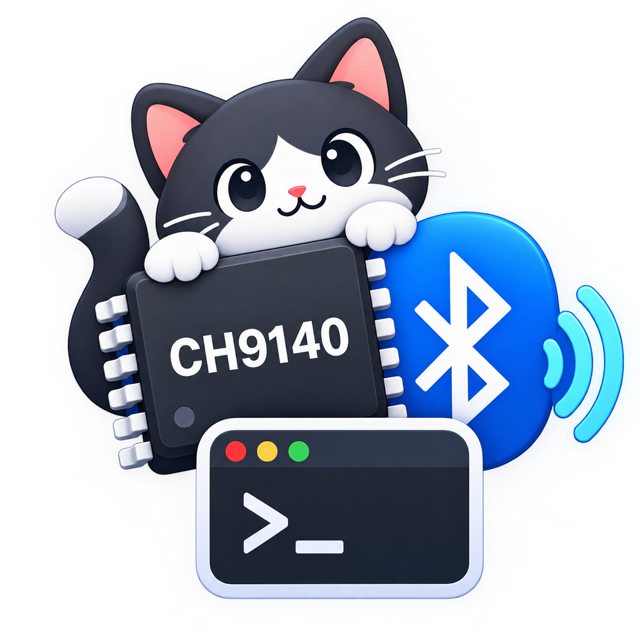

<div align="center">



# BLE2TTY

**无线 Console 调试终端** · 把 Console 线剪掉

[](https://github.com/oenhu/ble2tty/releases)
[](https://github.com/oenhu/ble2tty)
[](https://github.com/oenhu/ble2tty)
[](LICENSE)

**CH9140 蓝牙转串口 ↔ Mac 虚拟串口 (PTY)** · 内置终端仿真 / 收发监视 / 会话日志 · GUI + CLI

</div>

---

**无线 Console 调试终端**: 把 **CH9140 蓝牙转串口芯片** 桥接成 Mac 上的**虚拟串口**,
用于调试交换机/路由器等网络设备的 Console 口。**也支持直接连接 USB 有线串口**
(CH340/CP210x/FTDI 等适配器, 无需 CH9140)。内置**终端仿真器**(SwiftTerm, 键盘直连)、
**收发监视器**(HEX/文本, 中文 UTF-8/GBK 显示)与**会话日志**(raw+clean 双份),
同时兼容任意串口工具(screen / minicom / CoolTerm / PuTTY / SecureCRT 等)。

协议实现对照 WCH 官方资料(版权属 WCH 沁恒, 不随本仓库分发, 请从 [WCH 官网](https://www.wch.cn) 下载):
- `BleUartLib/iOS` CH9140Lib 官方 iOS 库(连接/配置逻辑逐字节对齐)
- `CH9140DS1.PDF` 芯片数据手册(FFF0-FFF3 GATT 通道定义)

## 功能

| 功能 | 说明 |
|---|---|
| 有线串口 | 直连 `/dev/cu.*` USB 串口(IOKit 枚举友好名), 任意波特率(含 460800/921600 等 PTY 无法表达的高速率), 流控/DTR/RTS(TIOCM*), CTS/DSR/RI/DCD 状态灯, 拔出自动落定+自动重连 |
| BLE 扫描/连接 | 自动过滤 CH9140 透传服务(0xFFF0), 可切换显示全部设备, 信号强度排序 |
| 设备 MAC 识别 | 连接就绪时自动解析设备真实 MAC(每两位 `-` 分割, 如 `DC-04-5A-5E-12-5B`), 显示于 最近连接/发现设备/状态栏; CH9140 出厂同名, MAC 是区分不同芯片的稳定标识。CoreBluetooth 不提供 MAC, 经系统蓝牙报告查询并缓存到最近连接 |
| 虚拟串口 | 基于 PTY 伪终端, 无需内核扩展; 路径 `~/Library/Application Support/BLE2TTY/cu.CH9140` |
| 波特率跟随 | 串口工具 `tcsetattr` 修改波特率/数据位/停止位/校验 → 自动经 0xFFF3 下发给芯片 |
| 串口参数配置 | 面板直接下发 波特率(300~1M)/数据位/停止位/校验/流控/DTR/RTS, 芯片回包校验 |
| MODEM 状态 | CTS/DSR/RI/DCD 实时指示灯(0x88 上报), 芯片发送缓冲区满/空流控 |
| 默认保存日志 | 双份保存: raw 原始日志(全量原始字节含 CR/退格/ANSI/GBK, raw/ 子目录) + clean 日志(GBK 转码、ANSI/CR/退格过滤开关, 便于日常查看复制); 文件名模板({device}/{name}/{date}/{time}/{datetime}/{seq}); 一键切割; 按会话/按日期分目录/按日期合并三种方式, 跨午夜自动切换 |
| 监视终端 | 收发监视(HEX/文本), 按行合并分包数据, 支持跨行复制; 整行发送(默认 CR 行尾, 带最近发送历史) + **交互模式**(键盘直连: Tab 补全/↑↓ 历史/Ctrl+C/Cmd+V 粘贴/退格编辑, 回显自动重绘) |
| 终端仿真 | 完整终端仿真器(SwiftTerm): ANSI 转义解析, 5000 行回滚, 键盘直连; 输入区聚焦时自动切换英文输入法, 移开自动恢复(可关闭) |
| 自动重连 | 意外断开或连接失败后自动重连: 指数退避(2s 起 30s 封顶, 不限次), 蓝牙关闭时挂起待恢复; 系统未缓存设备时自动转扫描查找(可在设置关闭) |

## 构建与运行

```bash
cd ble2tty
./build_app.sh          # Release 构建 + 打包 + ad-hoc 签名
open BLE2TTY.app        # 运行
```

只需 Xcode Command Line Tools(无需完整 Xcode)。首次运行会弹蓝牙权限请求,
或在 **系统设置 → 隐私与安全性 → 蓝牙** 中允许 BLE2TTY。

运行自检(154 项: 协议编解码与帧拆分/PTY 数据通路/有线串口(PTY 对模拟)/日志/raw+clean 双份/行装配与 OSC 过滤/设置/MAC 解析):

```bash
swift run CH9140SelfTest
```

## 使用(以调试交换机为例)

1. 打开 App → 点 **扫描设备** → 选择 `CH9140BLE2U`(或你的模块名)→ **连接**。
2. 连接后自动下发默认串口参数(出厂为交换机习惯: **9600 8N1 无校验**,
   可在 `⌘,` 设置里改)。CH9140 模块串口侧接交换机 Console 口。
3. 用任意串口工具打开虚拟串口:

   ```bash
   screen ~/Library/Application\ Support/BLE2TTY/cu.CH9140 9600
   # 退出: Ctrl+A 然后 K
   ```

   CoolTerm/minicom 等 GUI 工具里填同样的路径即可。
4. 串口工具里设什么波特率, 芯片就自动切到什么波特率(设置里可关闭"自动同步")。注意 macOS PTY 可表达的标准波特率上限为 **230400**, 串口工具设 460800 及以上不会被同步(日志有告警), 需要更高速率时请直接在控制面板下发。
5. 日志默认保存在 `~/Documents/CH9140Logs/`(可自定义), 默认按日期分目录存储, 自动记录全部会话。

### 有线模式(USB 串口, 无需 CH9140)

1. 左栏顶部切到 **有线** → 点 **刷新列表** → 选择端口(显示 USB Product Name)→ **连接**。
2. 打开时即以工具条上的当前参数(波特率/数据位/停止位/校验/流控)配置串口;
   之后改动点「应用」即时生效(termios 本地设置)。
3. 与 BLE 模式共用同一套 终端/监视/日志/发送区; DTR/RTS 与 CTS/DSR/RI/DCD 状态灯
   在真实适配器上有效(PTY 等伪终端不支持 MODEM 线, 自动降级)。
   驱动说明: **FTDI / CDC-ACM macOS 内置**; CH340/CH341 装 [WCH CH34x VCP 驱动](https://www.wch.cn/downloads/CH34XSER_MAC_ZIP.html);
   CP210x 装 SiLabs VCP 驱动; 枚举不到设备时先查驱动。
4. 有线模式支持任意高波特率(如 460800/921600, 不受虚拟串口 230400 上限约束)。

## 设置面板(⌘,)

- **通用**: 默认串口参数、连接后自动下发、波特率跟随、自动重连
- **日志**: 默认保存日志开关、TX 记录、时间戳、格式(纯文本/HEX/HEX+文本)、自定义保存目录、
  按日期存储方式(按会话 / 按日期分目录 `yyyy-MM-dd/…` / 按日期合并, 跨午夜自动切换)、
  **文件名模板**(变量 `{device}` 设备名 `{name}` 自定义标识 `{date}` `{time}` `{datetime}` `{seq}` 切割序号,
  实时预览; 重名自动补序号)、**截断并新建**按钮(日志卡片/终端工具条, ⌘T 快捷键默认关闭可在设置开启)
- **虚拟串口**: 串口名称(构成 `cu.<名称>`)、启动时自动创建

## 无界面模式(CLI)

不启动 GUI, 直接在终端完成 扫描 → 连接 → 下发参数 → 创建虚拟串口 的全流程,
适合脚本化/远程会话(与 GUI 共用同一签名 Bundle, 继承蓝牙权限):

```bash
BLE2TTY.app/Contents/MacOS/BLE2TTY --cli \
    --name CH9140BLE2U --baud 115200 --port-name CH9140 --timeout 45
```

| 参数 | 默认值 | 说明 |
|---|---|---|
| `--name` | `CH9140BLE2U` | 目标设备名(大小写不敏感的包含匹配) |
| `--baud` | `115200` | 连接后下发给芯片的波特率(8N1 无流控) |
| `--port-name` | `CH9140` | 虚拟串口名(构成 `cu.<名称>`) |
| `--timeout` | `45` | 扫描/连接总超时(秒) |
| `--uuid` | 无 | 多块同名芯片同场时按 CoreBluetooth UUID 直连(跳过扫描按名匹配) |
| `--wired` | 无 | 有线串口监视模式: 直接打开指定 `/dev/cu.*`(无需 CH9140/蓝牙), 打印收发 |

通道就绪后打印 `CLI_READY port=… compat=…`(供脚本解析), 之后每 10 秒打印
一次双向字节统计。退出码: `0` 收到 SIGTERM 正常退出, `2` 连接失败或超时,
`3` 创建虚拟串口失败, `4` 就绪后连接断开(清理符号链接后退出), `130` 收到 SIGINT。
就绪前的连接失败会在超时预算内自动重试; 就绪后断开不做重连。
SIGINT/SIGTERM 均会清理虚拟串口符号链接后再退出。

## 技术说明

```
串口工具 ──/dev/ttysNNN──┐
                         │ openpty()        BLE GATT
BLE2TTY App ─────── master fd ──────────► 0xFFF2 (WriteWithoutResponse)
BLE2TTY App ◄─────── master fd ◄────────── 0xFFF1 (Notify)
                     tcsetattr 巡检 ─────► 0xFFF3 (0x06 配置串口 / 0x07 流控)
                     MODEM 状态  ◄──────── 0xFFF3 (0x88 上报)
```

- 为什么用 PTY 而不是内核驱动: macOS 早已废弃第三方串口 kext, DriverKit 串口驱动
  需要额外 entitlement 与公证; PTY + `cu.*` 符号链接对所有串口工具透明, 零安装。
- 芯片出厂默认 115200 8N1 流控开, 本软件默认在连接后下发 9600 8N1 无流控(交换机 Console 标准)。
- 蓝牙侧是透传通道, 真正决定能否通讯的是 **芯片 UART 波特率与交换机 Console 波特率一致**。

## 目录结构

```
ble2tty/
├── Package.swift
├── build_app.sh                 # 一键构建 .app
├── Resources/Info.plist         # 含蓝牙权限说明
├── Sources/
│   ├── CH9140Core/              # 核心库
│   │   ├── Protocol/            #   CH9140 协议编解码(0x06/0x86/0x07/0x87/0x88)
│   │   ├── BLE/                 #   CoreBluetooth 中心端
│   │   ├── Serial/              #   PTY 虚拟串口 / 有线串口(WiredSerialPort) / IOKit 枚举
│   │   ├── Logging/             #   会话日志
│   │   ├── Settings/            #   UserDefaults 设置
│   │   └── BridgeModel.swift    #   粘合层
│   ├── BLE2TTY/                 # SwiftUI App(界面 + --cli 无界面入口)
│   └── CH9140SelfTest/          # 自检程序(154 项断言)
└── BLE2TTY.app                  # 构建产物
```

## 故障排查

### 已知问题与修复

| 问题 | 症状 | 修复版本 | 详细文档 |
|------|------|----------|----------|
| CPU 占用过高 (156%) | 电脑发热、风扇狂转 | v1.0.1 | [BUGFIX-2026-09-10-HighCPU.md](ble2tty/docs/BUGFIX-2026-09-10-HighCPU.md) |
| UI 渲染/状态栏刷新开销 | 大数据量时界面卡顿 | v1.0.2 | [PERF-2026-09-10-UIRenderingAndThrottling.md](ble2tty/docs/PERF-2026-09-10-UIRenderingAndThrottling.md) |
| 连接按钮永久卡灰 | 设备无响应后无法再次连接, 只能重启 App | v1.0.3 | [BUGFIX-2026-09-12-ConnectButtonStuck.md](ble2tty/docs/BUGFIX-2026-09-12-ConnectButtonStuck.md) |
| 扫描列表后台线程发布/发送队列无上限/转连不断旧连接 | UI 未定义行为、内存增长、多设备数据串流 | v1.0.4 | [BUGFIX-2026-09-12-ThreeAuditIssues.md](ble2tty/docs/BUGFIX-2026-09-12-ThreeAuditIssues.md) |
| 自动重连失效/陈旧数据复活/跨线程状态竞争/断开重复事件等 | 连接失败后不重连、断连期间积压数据发给新设备等 | v1.0.5 | [BUGFIX-2026-09-13-CodeAudit.md](ble2tty/docs/BUGFIX-2026-09-13-CodeAudit.md) |
| 重连静默终止/蓝牙关闭状态不落定/芯片满上报丢失 TX 停摆/MAC 解析管道死锁/fd 复用竞争等 | 桥接无声失效、边缘场景卡死 | v1.1.0 | [BUGFIX-2026-09-19-ReviewFixes.md](ble2tty/docs/BUGFIX-2026-09-19-ReviewFixes.md) |

### 常见问题

**Q: 虚拟串口路径在哪里？**  
A: 两个符号链接任选其一: `~/Library/Application Support/BLE2TTY/cu.CH9140`
和 `~/.ch9140/cu.CH9140`(名称均可在设置中改)。后者路径无空格, 专为 minicom 等
按空格分词设备路径的工具准备。

**Q: minicom 打不开串口路径？**  
A: minicom 会把设备路径按空格分词, 含 `Application Support` 空格的路径会被截断,
   请改用无空格的兼容链接 `~/.ch9140/cu.CH9140`。

**Q: 串口工具里设 460800/921600 波特率没有生效？**  
A: macOS PTY 的 termios 标准波特率上限为 230400, 超限的设定无法表达; 自 v1.0.5 起
   不再静默回落 9600, 而是记录告警并跳过同步。需要更高速率时请直接在控制面板
   (或 CLI `--baud`)下发给芯片。

**Q: 串口工具提示"Permission denied"？**  
A: 检查系统设置 → 隐私与安全性 → 蓝牙，确保 BLE2TTY 已授权

**Q: 有线模式提示串口被占用？**  
A: 串口同一时刻最好只被一个程序使用。App 打开时会尝试独占(TIOCEXCL, 驱动层尽力而为),
请先退出 screen/minicom/CoolTerm 再连接; 用 `lsof /dev/cu.xxx` 可查占用者。

**Q: 连接后没有数据？**  
A: 检查 CH9140 模块与目标设备的串口连线，确认波特率一致

**Q: CPU 占用很高？**  
A: v1.0.0 存在此问题，请升级到 v1.0.1+。详见 [BUGFIX 文档](ble2tty/docs/BUGFIX-2026-09-10-HighCPU.md)
